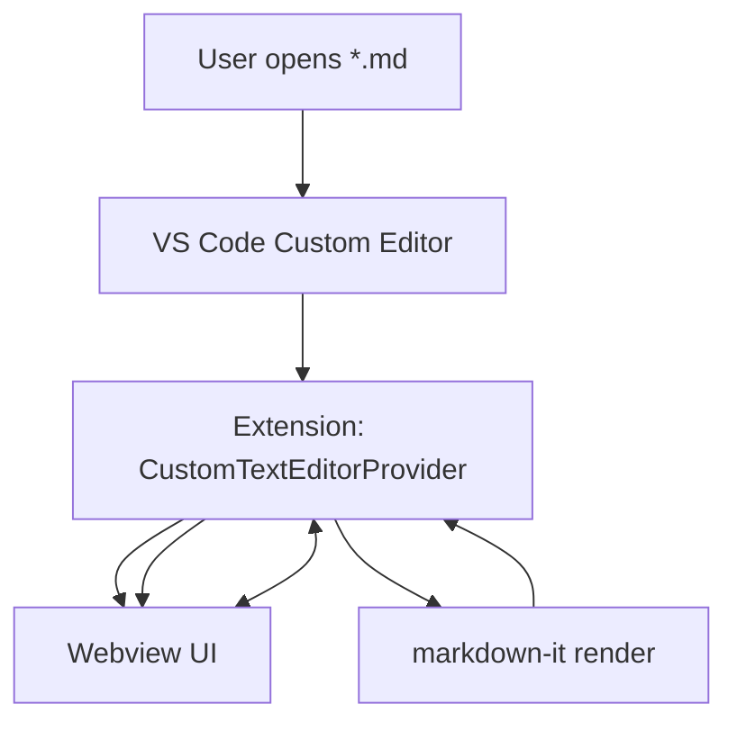

# Technical Design: Markdown 自定义编辑器三态视图（Editor / Split / Preview）

## Technical Solution

### Core Technologies
- VS Code Extension API：`CustomTextEditorProvider` / `registerCustomEditorProvider`
- Webview：HTML/CSS/JS（无外部 CDN 依赖）
- Markdown 渲染：`markdown-it`（在 Extension Host 侧渲染 HTML）
- 状态持久化：`ExtensionContext.workspaceState`（按工作区保存上次视图）

### Implementation Key Points
- Custom Editor 作为 `.md` 默认打开方式（优先使用 `contributes.customEditors` 的 `priority: "default"`；必要时补充写入 `workbench.editorAssociations` 作为兜底）。
- Webview 内部实现 3 个视图状态：
  - `editor`：仅编辑
  - `split`：编辑 + 预览
  - `preview`：仅预览
- Webview ↔ Extension Host 消息协议（单向可回放）：
  - `ready`：Webview 启动完成，请求初始数据
  - `setViewMode`：用户切换视图，扩展写入 `workspaceState` 并广播给同工作区其他打开的 `.md`
  - `edit`：用户编辑文本（节流/去重），扩展用 `WorkspaceEdit` 全量替换文档内容（保证可用的 undo/redo）
  - `sync`：扩展推送最新文档内容与渲染后的 HTML
- 渲染策略：
  - 文档变更 → 扩展侧用 `markdown-it` 渲染 → 推送 HTML
  - 对相同文本做 hash/对比，避免重复渲染与重复 postMessage
- 图片/链接策略（首版）：
  - 允许 `http/https/data` 图片
  - 对相对路径图片，尝试解析为文件 URI 并转换为 `webview.asWebviewUri`（只在 `localResourceRoots` 允许范围内）

## Architecture Design

## Architecture Decision ADR

### ADR-001: Use Custom Editor to provide Editor/Split/Preview
**Context:** 目标体验要求“同一标签页内三态切换”，VS Code 原生 Preview 属于独立 editor，无法自然满足。
**Decision:** 使用 `CustomTextEditorProvider` + Webview 实现三态 UI，并将 `.md` 默认关联到该 Custom Editor。
**Rationale:** 形态最接近 JetBrains；交互可控；可实现工作区级记忆。
**Alternatives:**
- 方案 A：继续使用内置 `markdown.showPreviewToSide`（拒绝原因：仍是两个编辑器/两个标签，无法同 tab 三态）
- 方案 B：复用内置 Markdown Preview 渲染引擎（拒绝原因：需要更深层集成与资源复用，复杂度更高）
**Impact:** 与原生编辑体验存在差异，需要清晰回退路径与文档说明。

### ADR-002: Render Markdown via markdown-it in extension host
**Context:** Webview 侧引入大体积库会增加资源管理与 CSP 配置成本。
**Decision:** 在扩展侧使用 `markdown-it` 渲染，Webview 仅负责展示 HTML 与 UI 交互。
**Rationale:** 依赖更可控；Webview 更轻；避免在 Webview 引入第三方脚本。
**Alternatives:**
- Webview 侧渲染（拒绝原因：打包/资源加载/CSP 配置与体积复杂）
**Impact:** 扩展侧渲染频率需要节流，避免大文件卡顿。

### ADR-003: Persist view mode in workspaceState
**Context:** 需求明确“按工作区记住上次选择”。
**Decision:** 使用 `context.workspaceState` 保存 `viewMode`。
**Rationale:** 与工作区绑定、跨重启持久化、无需写入用户设置。
**Alternatives:**
- globalState（拒绝原因：不符合按工作区维度）
- settings（拒绝原因：更偏全局偏好，且会污染配置文件）
**Impact:** 多窗口同工作区时可能存在状态竞争，需以“最后一次切换”为准。

## Security and Performance
- **Security:**
  - Webview CSP：`default-src 'none'`；仅允许 `webview.cspSource` 脚本；`style-src` 允许 inline；`img-src` 允许 `https: data:` 与 `webview.cspSource`。
  - 消息校验：仅处理预期 message type；对文本长度做上限保护（防止异常消息导致内存压力）。
- **Performance:**
  - Webview 输入事件节流（例如 150~300ms）
  - 扩展侧渲染节流与去重（同内容不重复渲染）
  - `retainContextWhenHidden` 以减少切换回标签时重建成本（注意内存占用权衡）

## Testing and Deployment
- **Testing:**
  - 手动验收用例：打开/切换/编辑/保存/重启恢复视图/外部修改同步。
  - 基础自动化：对“渲染节流/去重、viewMode 持久化键、消息协议”做单元测试（若引入测试框架成本过高，首版保留为手动回归清单）。
- **Deployment:** 维持现有 `tsc` 构建输出到 `dist/`；更新 `package.json` 的 `contributes.customEditors` 与命令声明；本地 `F5` 在 Extension Host 验证。
