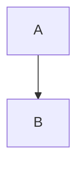

# Change Proposal: Mermaid 图表渲染支持（```mermaid fenced code）

## Requirement Background
当前扩展通过 `markdown-it` 在 Extension Host 侧将 Markdown 渲染为 HTML，并在 Webview 的 Preview/Split 中展示。该渲染路径默认只把围栏代码块当作普通代码展示，因此 ` ```mermaid `（Mermaid Diagram）无法直接以图形形式呈现。

本变更目标是在不引入远程资源、不破坏现有 CSP 与 Workspace Trust 约束的前提下，为 Preview/Split 增加 Mermaid 渲染能力。

## Change Content
1. 识别 ` ```mermaid ` 围栏代码块，并在渲染 HTML 中生成 Mermaid 占位节点（携带源码与行号锚点）。
2. Webview 侧加载本地 Mermaid 脚本并在内容更新后执行渲染，将占位节点替换为 SVG。
3. 渲染完成后刷新滚动同步锚点（适配 Mermaid 渲染导致的高度变化）。
4. 同步更新 README / 知识库 / CHANGELOG，记录新能力与限制。

## Impact Scope
- **Modules:** Rendering（markdownRenderer）、Webview UI（webviewHtml）、Extension packaging（dependencies）
- **Files (expected):**
  - `src/customEditor/markdownRenderer.ts`
  - `src/customEditor/webviewHtml.ts`
  - `src/customEditor/MarkdownEditorProvider.ts`
  - `package.json` / `package-lock.json`
  - `README.md`
  - `helloagents/wiki/modules/customEditor.md`
  - `helloagents/CHANGELOG.md`

## Core Scenarios

### Requirement: Render Mermaid diagram in Preview/Split
**Module:** Rendering / Webview

#### Scenario: Render on open
用户打开包含如下内容的 Markdown：

- 期望：Preview/Split 中显示为 Mermaid 图形（SVG），而非普通代码块。

#### Scenario: Render on edit
用户在 Split 模式编辑 Mermaid 源码（例如新增节点/连线）：
- 期望：预览区域在更新后重新渲染 Mermaid，并保持滚动同步可用。

## Risk Assessment
- **Risk:** Mermaid 渲染引入第三方脚本，可能增加 XSS/注入面。
  - **Mitigation:** 仅加载扩展包内本地脚本；维持严格 CSP；使用 Mermaid `securityLevel: 'strict'`。
- **Risk:** Mermaid 渲染为异步/动态 DOM 变更，可能影响现有滚动同步锚点。
  - **Mitigation:** 渲染后重新计算锚点 offset；必要时节流执行。

