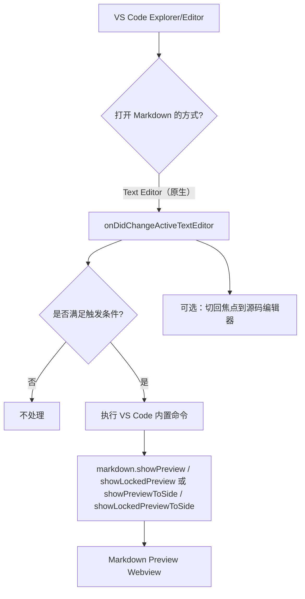
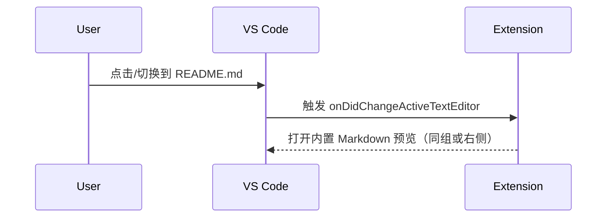

# Architecture Design

## Overall Architecture

## Tech Stack
- **Extension:** TypeScript + VS Code Extension API
- **Build:** tsc（CommonJS 输出到 `dist/`）
- **Runtime Dependency:** `minimatch`（用于 excludeGlobs 路径匹配）

## Core Flow

## Major Architecture Decisions
| adr_id | title | date | status | affected_modules | details |
|--------|-------|------|--------|------------------|---------|
| ADR-001 | 复用 VS Code 内置 Markdown 预览命令而非自研渲染 | 2026-01-20 | ✅Adopted | extension | history/2026-01/202601202226_md_auto_preview/how.md#adr-001-复用-vs-code-内置-markdown-预览命令 |
| ADR-002 | 使用 onDidChangeActiveTextEditor 触发自动预览（配合防抖/抑制循环） | 2026-01-20 | ✅Adopted | extension | history/2026-01/202601202226_md_auto_preview/how.md#adr-002-以编辑器激活变化作为触发源 |
| ADR-003 | 引入 Custom Editor 实现同页 Split 预览 | 2026-01-21 | ❌Deprecated | extension | history/2026-01/202601211231_markdown_custom_editor_split/how.md#adr-003-引入-custom-editor-实现同页-split-预览 |
