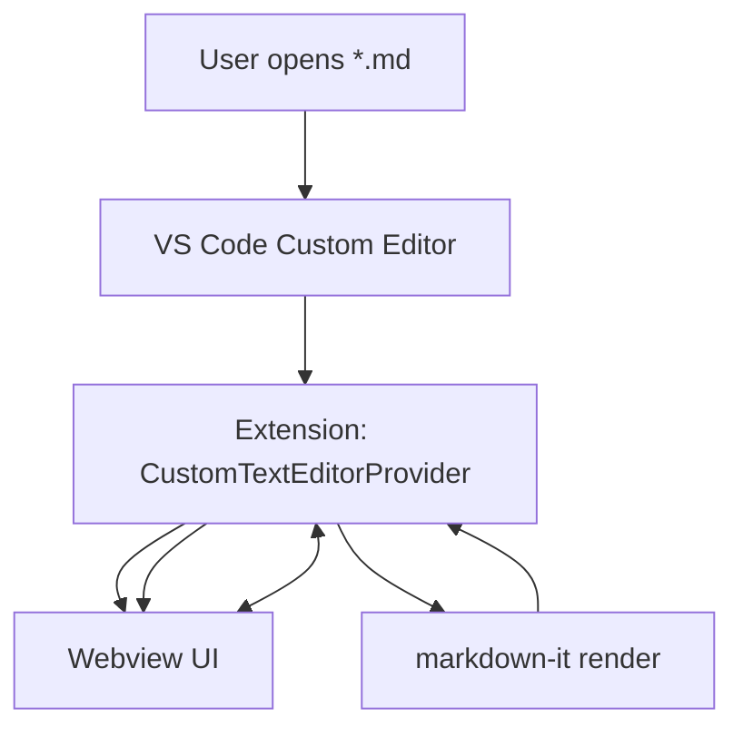
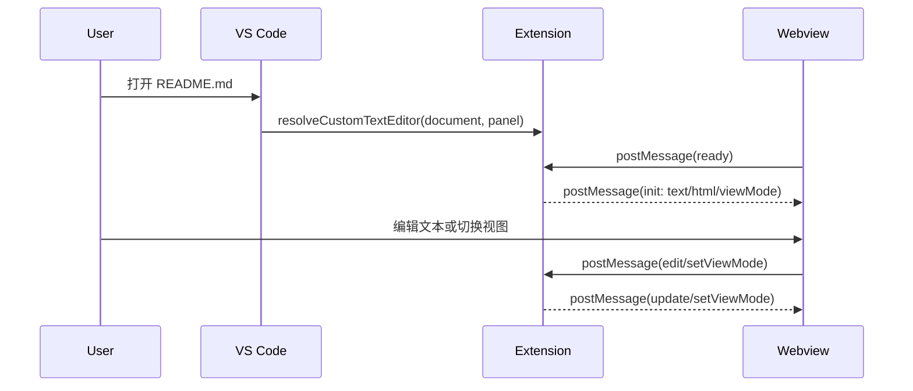

# Architecture Design

## Overall Architecture

## Tech Stack
- **Extension:** TypeScript + VS Code Extension API
- **Build:** tsc（CommonJS 输出到 `dist/`）
- **Runtime Dependency:** `markdown-it`（在扩展侧渲染 Markdown 为 HTML）

## Core Flow

## Major Architecture Decisions
| adr_id | title | date | status | affected_modules | details |
|--------|-------|------|--------|------------------|---------|
| ADR-001 | 使用 Custom Editor 实现同页三态（Editor/Split/Preview） | 2026-02-05 | ✅Adopted | extension, customEditor | history/2026-02/202602051558_md_editor_split_preview/how.md#adr-001-use-custom-editor-to-provide-editorsplitpreview |
| ADR-002 | 在扩展侧用 markdown-it 渲染预览 | 2026-02-05 | ✅Adopted | customEditor | history/2026-02/202602051558_md_editor_split_preview/how.md#adr-002-render-markdown-via-markdown-it-in-extension-host |
| ADR-003 | 视图模式按工作区持久化（workspaceState） | 2026-02-05 | ✅Adopted | extension, customEditor | history/2026-02/202602051558_md_editor_split_preview/how.md#adr-003-persist-view-mode-in-workspacestate |
| ADR-004 | 复用 VS Code 内置 Markdown Preview 命令实现自动预览 | 2026-01-20 | ❌Deprecated | extension | history/2026-01/202601202226_md_auto_preview/how.md#adr-001-复用-vs-code-内置-markdown-预览命令 |
